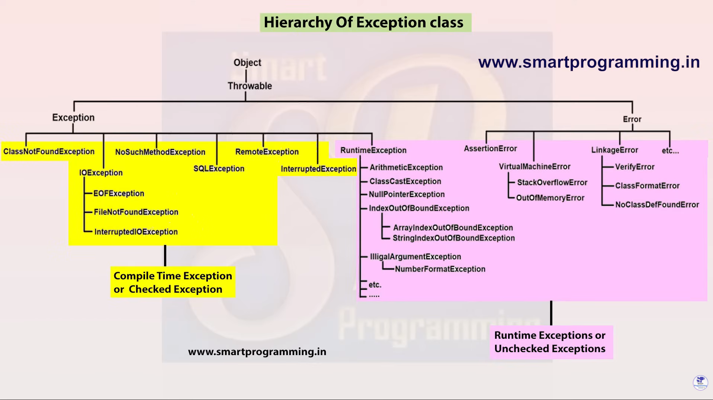

# 🛡️ Exception Handling in Java — Complete Notes

> **Source:** Based on the reference material provided in `reference.txt`.
> **Last Updated:** 11 Feb 2026

---

## 📖 Table of Contents

| # | Topic |
|---|-------|
| 1 | [What is an Exception?](#1--what-is-an-exception-in-java) |
| 2 | [What is Exception Handling?](#2--what-is-exception-handling-in-java) |
| 3 | [Why Do We Need Exception Handling?](#3--why-do-we-need-exception-handling) |
| 4 | [Hierarchy of Java Exception Classes](#4--hierarchy-of-java-exception-classes) |
| 5 | [Types of Exceptions — Checked vs Unchecked](#5--types-of-exceptions--checked-vs-unchecked) |
| 6 | [Error vs Exception](#6--error-vs-exception) |
| 7 | [Mermaid Diagram — Exception Hierarchy](#7--mermaid-diagram--complete-exception-hierarchy) |
| 8 | [Quick Revision Cheat-Sheet](#8--quick-revision-cheat-sheet) |

---

## 1. 🤔 What is an Exception in Java?

An **exception** is an event that occurs **during the execution** of a program and **disrupts the normal flow** of instructions.

### Real-Life Analogy 🎯

> Imagine you're driving on a highway (your program is running).
> Suddenly, a tyre gets punctured (an exception occurs).
> If you don't have a spare tyre (no exception handling), you're stuck on the road (program crashes).
> But if you carry a spare (exception handling), you change the tyre and continue your journey (normal flow is maintained).

### Common Causes of Exceptions

| Cause | Example |
|-------|---------|
| Invalid user input | Entering text where a number is expected |
| File not found | Trying to read a file that doesn't exist |
| Division by zero | `int result = 10 / 0;` |

### Key Point

When an exception occurs, it is represented by an **object** of a subclass of the `java.lang.Exception` class.

> 💡 **Think of it this way:** Every exception is like an "incident report" — Java creates an object that holds all the details about what went wrong.

---

## 2. 🔧 What is Exception Handling in Java?

**Exception Handling** is a mechanism that allows a program to **handle runtime errors** so that the **normal flow of the application can be maintained**.

### Real-Life Analogy 🎯

> Think of exception handling like a **safety net under a tightrope walker**.
> The walker (your program) might slip (encounter a runtime error), but the safety net (exception handling) catches them and prevents a disaster (program crash).

### Exceptions It Can Handle

| Exception | When It Occurs |
|-----------|----------------|
| `ClassNotFoundException` | When the JVM can't find the class you're trying to use |
| `IOException` | When an input/output operation fails |
| `SQLException` | When a database operation fails |
| `RemoteException` | When a remote method invocation fails |

---

## 3. 🎯 Why Do We Need Exception Handling?

Without exception handling, when a runtime error occurs, the program **abruptly terminates** and all subsequent code is skipped.

### Analogy 🎯

> Imagine a chef following a recipe (program).
> If step 3 says "add sugar" but there's no sugar (error), without exception handling, the chef **throws away the entire dish** and stops cooking.
> With exception handling, the chef says "No sugar? Use honey instead!" and **continues cooking the rest of the dish**.

**In short:** Exception handling ensures your program is **robust and error-free** — it doesn't crash at the first sign of trouble.

---

## 4. 🏗️ Hierarchy of Java Exception Classes

Exceptions in Java are organized in a **hierarchical structure** (like a family tree). All exception classes are part of the `java.lang` package.

### The Family Tree 🌳

```
                        Object
                          │
                      Throwable          ← The "Grandparent" of all errors & exceptions
                      /        \
                 Exception      Error
                /     \            \
         Checked   RuntimeException  (System-level problems)
        Exceptions  (Unchecked)
```

### Real-Life Analogy 🎯

> Think of `Throwable` as the **principal of a school**.
> Under the principal, there are **two vice-principals**:
> - **`Exception`** — Manages student issues that teachers CAN handle (checked + unchecked exceptions).
> - **`Error`** — Manages infrastructure problems like building collapse that teachers CANNOT handle (e.g., `OutOfMemoryError`).

### Understanding Each Level

| Class | Role | Analogy |
|-------|------|---------|
| **`Object`** | Root of all Java classes | The foundation of the school building |
| **`Throwable`** | Superclass of ALL errors and exceptions | The principal — everything reports to them |
| **`Error`** | Serious system errors that apps **usually cannot handle** | A power outage — students can't fix it |
| **`Exception`** | Conditions that a program **might want to catch** | A student forgot their homework — teacher can handle it |

---

## 5. 🔀 Types of Exceptions — Checked vs Unchecked

Java divides exceptions into **two main categories**. Understanding this distinction is crucial!

### 📋 Checked Exceptions (Compile-Time Exceptions)

These are exceptions that the **compiler checks at compile time**. You **MUST** either:
- Handle them using `try-catch`, **OR**
- Declare them using `throws`

| Exception | When It Occurs |
|-----------|----------------|
| `IOException` | I/O operation failure |
| `SQLException` | Database error |
| `ClassNotFoundException` | Class not found at runtime |
| `RemoteException` | Remote method call failure |
| `InterruptedException` | Thread interrupted |
| `NoSuchMethodException` | Method not found |
| `FileNotFoundException` | File not found (subclass of IOException) |
| `EOFException` | Unexpected end of file (subclass of IOException) |

#### Analogy 🎯

> Checked exceptions are like **mandatory safety checks before a flight**.
> The airline (compiler) WON'T let you board (compile) unless you have your passport and boarding pass (handled the exception). If you don't, you are stopped right there!

---

### ⚡ Unchecked Exceptions (Runtime Exceptions)

These are exceptions that occur **at runtime** and do **NOT** need explicit handling. They are typically caused by **programming errors** (bugs).

| Exception | When It Occurs |
|-----------|----------------|
| `ArithmeticException` | e.g., Division by zero |
| `NullPointerException` | Accessing a method/field on a `null` reference |
| `ClassCastException` | Invalid type casting |
| `ArrayIndexOutOfBoundsException` | Accessing array with an invalid index |
| `StringIndexOutOfBoundsException` | Accessing string character at invalid index |
| `IllegalArgumentException` | Passing illegal arguments to a method |
| `NumberFormatException` | Converting an invalid string to a number |
| `IndexOutOfBoundsException` | General index out of range |

#### Analogy 🎯

> Unchecked exceptions are like **tripping over your own shoelaces**.
> No one checks your shoelaces before you start walking (compiler doesn't check), but if they are untied (bug in code), you WILL fall (exception at runtime). It's YOUR responsibility to tie them!

---

### 🆚 Side-by-Side Comparison

| Feature | Checked Exception | Unchecked Exception |
|---------|-------------------|---------------------|
| **When detected** | Compile time | Runtime |
| **Must handle?** | ✅ Yes (mandatory) | ❌ No (optional) |
| **Caused by** | External conditions (file, network, DB) | Programming errors (bugs) |
| **Parent class** | `Exception` (directly) | `RuntimeException` |
| **Analogy** | Airport security check ✈️ | Tripping over shoelaces 👟 |
| **Examples** | `IOException`, `SQLException` | `NullPointerException`, `ArithmeticException` |

---

## 6. 🚨 Error vs Exception

Both `Error` and `Exception` are children of `Throwable` — but they are **very different** in nature.

> 🧠 **One-line difference:**
> - **Error** = Something went wrong with the **JVM/system** — you usually **cannot fix it**.
> - **Exception** = Something went wrong in your **code/logic** — you usually **can fix it**.

---

### 💥 What is an Error?

An **Error** is a **serious problem** at the system/JVM level that your program **cannot recover from**.

> Think of it like a **power outage in a hospital** — the hospital (your app) just can't run. You can't "catch" a power cut and keep going.

#### Common Errors with Examples

**1. `StackOverflowError`** — happens when a method calls itself infinitely (infinite recursion)

```java
public class Demo {
    static void infiniteMethod() {
        infiniteMethod(); // calls itself forever!
    }

    public static void main(String[] args) {
        infiniteMethod(); // 💥 StackOverflowError
    }
}
```

**2. `OutOfMemoryError`** — happens when the JVM runs out of heap memory

```java
public class Demo {
    public static void main(String[] args) {
        int[] arr = new int[Integer.MAX_VALUE]; // 💥 OutOfMemoryError
    }
}
```

> ❌ These errors **cannot be recovered** from — even if you try to `catch` them, the JVM is already in a broken state.

---

### ✅ What is an Exception?

An **Exception** is a **problem in your application code** that you **can handle** and recover from gracefully.

> Think of it like a **flat tyre** — annoying, but you have a spare tyre (exception handling). Fix it and continue the journey!

#### Common Exceptions with Examples

**1. `ArithmeticException`** — dividing a number by zero

```java
public class Demo {
    public static void main(String[] args) {
        int result = 10 / 0; // 💥 ArithmeticException: / by zero
    }
}
```
✅ **Fixed with try-catch:**
```java
try {
    int result = 10 / 0;
} catch (ArithmeticException e) {
    System.out.println("Cannot divide by zero! " + e.getMessage());
}
// Program continues normally ✅
```

**2. `NullPointerException`** — calling a method on a `null` object

```java
public class Demo {
    public static void main(String[] args) {
        String name = null;
        System.out.println(name.length()); // 💥 NullPointerException
    }
}
```
✅ **Fixed:**
```java
if (name != null) {
    System.out.println(name.length());
} else {
    System.out.println("Name is null!");
}
```

**3. `ArrayIndexOutOfBoundsException`** — accessing an index that doesn't exist

```java
int[] nums = {10, 20, 30};
System.out.println(nums[5]); // 💥 ArrayIndexOutOfBoundsException
```
✅ **Fixed:**
```java
try {
    System.out.println(nums[5]);
} catch (ArrayIndexOutOfBoundsException e) {
    System.out.println("Index does not exist!");
}
```

---

### 🆚 Error vs Exception — Side-by-Side

| Feature | ❌ Error | ✅ Exception |
|---------|----------|-------------|
| **Who causes it?** | JVM / System | Your code / logic |
| **Can you handle it?** | Usually **NO** | Usually **YES** |
| **Should you catch it?** | ❌ Almost never | ✅ Yes, with try-catch |
| **Program recovery?** | Usually impossible | Yes, program can continue |
| **Examples** | `StackOverflowError`, `OutOfMemoryError` | `NullPointerException`, `IOException` |
| **Analogy** | Power outage 🔌 (can't fix) | Flat tyre 🚗 (can fix with spare) |

---

### 📌 Quick Memory Tip

```
Throwable
├── Error        → JVM is sick 🤒 — you can't cure it
└── Exception    → Your code has a bug 🐛 — you CAN fix it
```

---

## 7. Complete Exception Hierarchy

